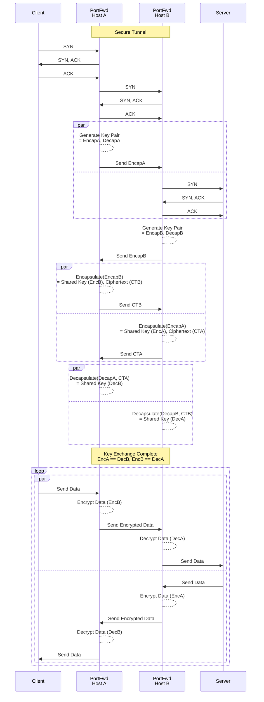

# TCP/UDP Port Forwarder

A simple TCP and UDP based port forwarder for IPv4 and IPv6 which supports concurrent connections and secure tunnels using hybrid post-quantum crypto.

### Usage

```
 portfwd -tcp [<bind_host>:]<listen_port>[s]:<remote_host>:<remote_port>[s]
         -udp [<bind_host>:]<listen_port>:<remote_host>:<remote_port>
         -logfile <portfwd.log>
         -config <portfwd.conf>
         -ft-tcp
```

You can specify as many TCP and/or UDP forwarders as you wish on the command line - if you omit `bind_host` then it defaults to `localhost` - to listen on all IPs use `0.0.0.0` for IPv4 or `[::]` for IPv6. If you duplicate `bind_host` and `listen_port` then it will load balance between the destinations (round-robin by default). For TCP connections, instead of round-robin load balancing you can specify `-ft-tcp`, which will keep using the same destination until it fails and will then move to the next (fault tolerant).

For `bind_host` and `remote_host` you can either specify an IPv4 address (e.g. `192.0.2.1`), IPv6 address (e.g. `[2001:db8::1]`) or a DNS hostname (e.g. `host.domain`).

You also have the option of specifying multiple TCP and/or UDP forwarders (one per line) within a configuration file, e.g:

```
tcp [<bind_host>:]<listen_port>[s]:<remote_host>:<remote_port>[s]
udp [<bind_host>:]<listen_port>:<remote_host>:<remote_port>
```

Command line arguments can be shortened as long as they don't become ambiguous (e.g. `-t` for `-tcp` and `-c` for `-config`).

### PQC Secure Tunnel (Experimental)

If you specify "s" after the port number then it will establish a secure tunnel between two instances of PortFwd. It uses the draft X-Wing KEM (https://datatracker.ietf.org/doc/html/draft-connolly-cfrg-xwing-kem), which is a hybrid post-quantum key encapsulation mechanism to generate ephemeral encryption/decryption keys, which are used by ChaCha20-Poly1305. It should be noted that this only provides confidentiality and integrity - it doesn't authenticate the hosts.



Each TCP session will use a different set of encryption and decryption keys that are generated randomly when the TCP session is established. The maximum amount of data a single TCP session can send using the same set of keys is 2<sup>64</sup> packets (18.4 quintillion) as we use a `uint64` packet counter as the `nonce`. It is extremely unlikely that any TCP session is going to get anywhere near this number, but to prevent `nonce` re-use it will terminate the TCP session if you do.

To create a secure tunnel for HTTP traffic you could use it as follows:

#### Host 1

<pre>
portfwd -tcp 0.0.0.0:8080:&lt;Host 2&gt;:8080<b>s</b>
</pre>

#### Host 2

<pre>
portfwd -tcp 0.0.0.0:8080<b>s</b>:&lt;Server&gt;:80
</pre>

If a Client then connects to Host 1 on port 8080 then it will tunnel the traffic towards the Server via Host 2 using an encrypted tunnel.

### Installation

If you want to background the process and log the connections to a file then you can use the following syntax:

```
portfwd <arguments> -logfile <portfwd.log> &
```

Alternatively you can run it as a system service via Systemd using the following commands:

```
cat <<EOF | sudo tee /etc/systemd/system/portfwd.service 1>/dev/null
[Unit]
Description=TCP/UDP Port Forwarder

[Service]
ExecStart=/usr/local/bin/portfwd -conf /etc/portfwd.conf
Restart=on-success

[Install]
WantedBy=default.target
EOF

sudo systemctl daemon-reload

sudo systemctl enable --now portfwd.service

sudo systemctl status portfwd.service
```

> [!CAUTION]
> There are no guarantees the code in any branch will compile or work successfully at any given time - only release tags are guaranteed to compile and work.
